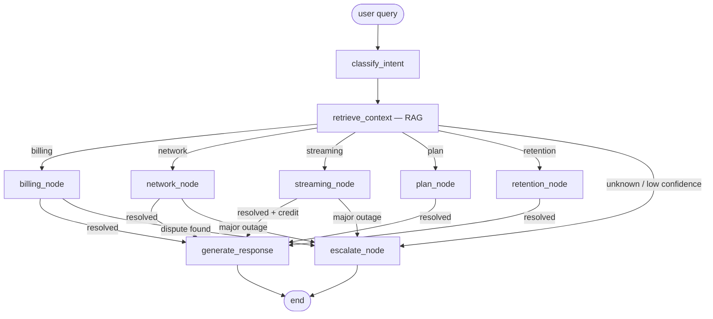

# CareGraph

A full working app — FastAPI backend + browser chat UI — built around a single LangGraph agent that replaces Deutsche Telekom Digital Labs' fragmented billing / network / streaming / plan support flows with one conversational entry point. Grounded in policy via RAG, backed by mock tools standing in for real backend systems, and built to escalate to a human the moment it isn't confident.

**Author:** Chandresh — built for DTDL's *The Talent Hack*, July 2026
**Status:** working app, fully tested in mock mode (see [Evaluation](#evaluation)), ready to point at a real LLM and real DTDL APIs.
**License:** MIT · **CI:** classifier + retrieval eval runs automatically on every push (`.github/workflows/eval.yml`)

---

## Brief

DTDL is running one of the most demanding streaming operations in Europe for six straight weeks during the FIFA World Cup 2026 — ~18M concurrent subscribers, ~1,500 bookings/minute at peak. That kind of scale generates a matching spike in support volume: billing disputes, streaming failures, plan upgrades, retention conversations — today routed through separate flows depending on issue type. **CareGraph** is a single LangGraph agent that classifies intent, retrieves grounding context via RAG, calls the right backend tool, and either resolves the request end-to-end or escalates to a human with full context attached — never silently guessing on something like a disputed charge.

## The problem, specifically

DTDL's own hiring page states they ran **~18 million concurrent subscribers across Europe** and **~1,500 bookings per minute at peak**, with **200,000 World Cup orders in a single day in Germany alone**. Two concrete failure modes follow directly from that scale, and both are the flagship scenarios this app demos end-to-end:

1. **Payment retries under load create duplicate charges.** A customer buys World Cup Final pay-per-view, the request times out under load, they retry, and now they're billed twice. This needs *verification*, not an instant auto-refund — it's exactly the kind of case a good agent should recognize it can't safely resolve alone.
2. **Regional CDN congestion during marquee matches degrades streams.** "The match won't load" is the single most predictable support ticket during a World Cup fixture. This one *can* be resolved automatically: explain what's happening, give a fix, apply a credit, done.

CareGraph is built so these two cases take genuinely different paths through the graph — that branching is the actual point of the project, not just intent classification for its own sake.

## What it does

1. Classifies the incoming query into `billing / network / streaming / plan / retention / unknown`, with a confidence score.
2. Retrieves the top-k relevant policy/FAQ chunks via RAG, regardless of intent, so every response is grounded.
3. Routes to a specialist node, which calls the relevant mock backend tool(s).
4. The specialist can itself decide to escalate — e.g. a disputed duplicate charge or a major outage doesn't get auto-resolved even though the *intent* was classified correctly.
5. Anything low-confidence, unresolved, or explicitly requiring a human gets escalated with a ticket and a full reason attached, so the customer never repeats themselves.

## The app itself

`api.py` is a FastAPI backend with three endpoints (`/api/chat`, `/api/users`, `/api/health`) wrapping the graph, serving a static chat UI at `/`. It's a deliberately two-panel layout, not a plain chat window:

- **Left — the conversation.** Pick a seeded customer (or type your own message), same as talking to support normally.
- **Right — the agent's reasoning, live.** The routing path the request took (`classify → retrieve → [intent] → resolved/escalate`), the confidence score as a meter, the exact tool called with its raw result, which FAQ/policy chunks were retrieved, and the outcome — resolved, or escalated with a ticket ID.

That right-hand panel is the actual design decision worth explaining if asked: a chatbot that just replies is a demo; a chatbot that shows *why* it's confident enough to act, or not, is the agentic-systems point DTDL is evaluating. Five scenario chips reproduce `demo.py`'s exact five cases in one click each, for a fast live walkthrough.

## Architecture



| Node | Responsibility |
|---|---|
| `classify_intent` | LLM call → `(intent, confidence)` |
| `retrieve_context` | TF-IDF retrieval over `data/faq_corpus.json`, always runs so every path is grounded |
| `billing` / `network` / `streaming` / `plan` / `retention` | call the matching mock tool(s); each can set `escalate=True` on its own |
| `escalate` | raises a ticket, drafts a handoff message with the reason attached |
| `generate_response` | drafts the grounded final reply from tool output + retrieved context |

## Tech stack → challenge topics

| Challenge topic | Where it lives |
|---|---|
| Python Development | Entire project — typed, modular, unit-tested |
| Generative AI | `src/llm.py` — response generation grounded in tool output + retrieved context |
| Agentic AI Systems | The graph itself: autonomous routing, tool calls, and a self-directed decision to escalate |
| LLMs | `OpenAILLM` in `src/llm.py` (ChatOpenAI via LangChain) |
| RAG | `src/rag.py` — TF-IDF retrieval over `data/faq_corpus.json` |
| LangChain | `ChatPromptTemplate`, `BaseRetriever` adapter, `\|` chain composition in `llm.py` / `rag.py` |
| LangGraph | `src/graph.py` — `StateGraph`, conditional edges, compiled runnable |
| (app layer, not on their list, added anyway) | `api.py` (FastAPI) + `web/index.html` — turns the graph into something clickable in under a minute |

## Design decisions worth discussing in the room

- **Every module degrades gracefully.** `MockLLM` and `OpenAILLM` implement the same two-method interface; `get_llm_backend()` picks one based on whether `OPENAI_API_KEY` is set and `langchain_openai` is importable. Same pattern in `rag.py` for the LangChain `BaseRetriever` wrapper. This is what makes the whole thing testable offline (see below) — same reasoning as bringing down per-user token cost on a production LLM app: don't spend API calls on things you can verify for free.
- **Retrieval is TF-IDF, not embeddings — deliberately.** For a few dozen policy snippets, lexical retrieval is competitive with embeddings and needs no API calls, which matters when you're iterating on prompt/routing quality repeatedly during development. Swapping in FAISS/Chroma + real embeddings is contained to `rag.py`; nothing else changes.
- **Escalation is a first-class node, not an afterthought.** A specialist can classify intent correctly *and* still decide the case needs a human (disputed charge, major outage). Getting the *intent* right and getting the *resolution* right are treated as separate decisions.
- **Nodes are plain functions with zero LangGraph import.** `nodes.py` never imports `langgraph`, which means every node is a one-line unit test (see `eval/run_eval.py`) and the same logic can run under a completely dependency-free fallback (`orchestrator.py`) if `langgraph` isn't installed yet.
- **Ticket IDs use `zlib.crc32`, not Python's built-in `hash()`.** `hash()` on strings is randomized per process in Python 3 — fine for a dict lookup, useless for anything you want reproducible across runs. Small thing, but the kind of small thing that causes confusing bug reports later.
- **The UI exposes the trace panel instead of hiding it.** Most chat UIs hide everything except the reply. Here, the routing path, confidence, tool call, and retrieval results are always visible for the last turn — because for an *agentic* system the interesting question isn't "what did it say," it's "why did it decide that," and that's what a technical reviewer actually wants to see in under a minute.
- **`api.py` and `web/index.html` are live-verified**, not just syntax-checked — `uvicorn api:app` boots, `/api/health`, `/api/users`, `/api/chat`, and the static UI at `/` all return correct responses end-to-end against the real compiled StateGraph.

## Project structure

```
caregraph/
├── README.md
├── LICENSE
├── .gitignore
├── .github/workflows/eval.yml   # CI: runs eval/run_eval.py on every push
├── requirements.txt
├── .env.example
├── demo.py                 # run 5 end-to-end scenarios (CLI)
├── api.py                    # FastAPI backend -- the real app entry point
├── web/
│   └── index.html               # chat UI + live agent-reasoning trace panel
├── src/
│   ├── state.py             # CareGraphState TypedDict
│   ├── tools.py              # mock DTDL backend systems
│   ├── rag.py                  # TF-IDF retriever + LangChain adapter
│   ├── llm.py                   # MockLLM / OpenAILLM, same interface
│   ├── nodes.py                  # node + routing functions (no langgraph import)
│   ├── graph.py                   # real LangGraph StateGraph (primary deliverable)
│   └── orchestrator.py             # zero-dependency fallback runner
├── data/
│   └── faq_corpus.json               # 12 policy/FAQ chunks
└── eval/
    ├── eval_set.json                  # 12 labeled routing examples
    └── run_eval.py                     # classifier + retrieval eval harness
```

## Setup & run

**The full app** (chat UI backed by the real agent):

```bash
pip install -r requirements.txt
cp .env.example .env            # optional -- add OPENAI_API_KEY for the real LLM
uvicorn api:app --reload
# open http://localhost:8000
```

Pick a seeded customer, click one of the five scenario chips (or type your
own message), and watch the right-hand panel fill in live: routing path,
classified intent + confidence, the exact tool called and its raw result,
which FAQ/policy chunks were retrieved, and whether the case resolved or
escalated — with the ticket ID if it did.

**CLI only**, no server, for a fast terminal walkthrough of the same logic:

```bash
python demo.py                 # runs the 5 scenarios end-to-end
python eval/run_eval.py         # classifier + retrieval accuracy report
```

Without `langgraph` installed or no `OPENAI_API_KEY` set, everything still
runs end to end — both `api.py` and `demo.py` auto-detect and fall back to
the mock LLM and the dependency-free orchestrator, and the UI's status
line reports which one is live (`langgraph` vs `fallback-orchestrator`).

## Example run

Actual output, captured from this repo, MockLLM backend (no API key needed to reproduce):

```
SCENARIO: Duplicate PPV charge (World Cup Final) -> should escalate
USER (U1001): I was charged twice for the World Cup final pay-per-view and I want my money back.
intent          : billing  (confidence=0.95)
escalated       : True
ticket_id       : DTDL-07748
CareGraph reply : Hi Anaya, I want to make sure this is handled properly, so I'm connecting
you with a specialist. I've opened ticket DTDL-07748 (Disputed duplicate charge of ₹499 for
World Cup Final PPV -- requires manual verification.) and included everything you've told me
so you won't need to repeat yourself.

SCENARIO: Match won't load during peak hours -> should self-resolve
USER (U1003): The India vs Brazil match keeps buffering and won't load, what's going on?
intent          : streaming  (confidence=0.94)
escalated       : False
CareGraph reply : Hi Meera, thanks for flagging that. Your stream is affected by stream
degraded during live event -- this is on our side, not your connection. It should clear up
in about 15 minutes. In the meantime, try switching quality to Auto or reconnecting to the
nearest server. We've applied a service credit to your account for the disruption, no action
needed from you.
```

Full output (all 5 scenarios: billing-escalate, streaming-resolve, plan-resolve, retention-resolve, unknown-escalate) is reproduced by running `python demo.py` — nothing above is trimmed or cherry-picked differently than what the script prints.

## Push to GitHub

```bash
git init
git add .
git commit -m "CareGraph: LangGraph support agent for DTDL Talent Hack"
git branch -M main
git remote add origin https://github.com/<your-username>/caregraph.git
git push -u origin main
```

`.gitignore` already excludes `.env`, virtual envs, and `__pycache__/`, so no
secrets or local cruft end up in the repo. The GitHub Actions workflow in
`.github/workflows/eval.yml` runs the eval harness on every push automatically.

## Evaluation

```
Intent classification -- backend: mock
Accuracy: 12/12 = 100%

Retrieval smoke test (top-1 topic match)
Retrieval top-1 accuracy: 5/5 = 100%
```

The point of `eval/run_eval.py` isn't that 100% is impressive on a 12-example hand-built set — it's that the harness is backend-agnostic. Point `OPENAI_API_KEY` at a real key and the exact same script evaluates `OpenAILLM` instead of `MockLLM`, no code changes. That's the habit worth carrying over from RLHF/eval work into agent-building: don't just ship a classifier, ship the harness that tells you when it stops working.

## Limitations & next steps

Being upfront about what's mocked vs. real, because that's the first thing a good interviewer will ask:

- **Tools are seeded, in-memory mocks**, not real DTDL billing/network/CRM systems. Swapping them for real API calls doesn't touch `nodes.py` — only `tools.py`.
- **Retrieval is lexical (TF-IDF)**, fine at this corpus size, would move to embeddings + a real vector store (FAISS/Chroma/Qdrant) at production scale.
- **No conversation memory across turns** — each query is a fresh `CareGraphState`. Next step: thread a session id through and persist state (this is the same pattern as a memory/RAG layer over conversation history).
- **No guardrails layer yet** — no PII redaction, no prompt-injection defense on retrieved content, no rate limiting. Would add before this touches a real customer.
- **Confidence threshold (0.55) and keyword lists in `MockLLM` are hand-tuned**, not learned — expected, since it's a stand-in for a real LLM call, not a shipped classifier.

## Stage 2 relevance

The build sprint brief is "work on a new DTDL-specific business problem, build a POC." This project already *is* that shape — real DTDL pain point (their own posted World Cup numbers), working code, clear articulation of what's mocked vs. real, and a demo that runs in front of someone in under a minute. Stage 2 is a chance to either extend this (multi-turn memory, a real tool integration) or rebuild the same pattern against whatever problem statement they actually hand out.
