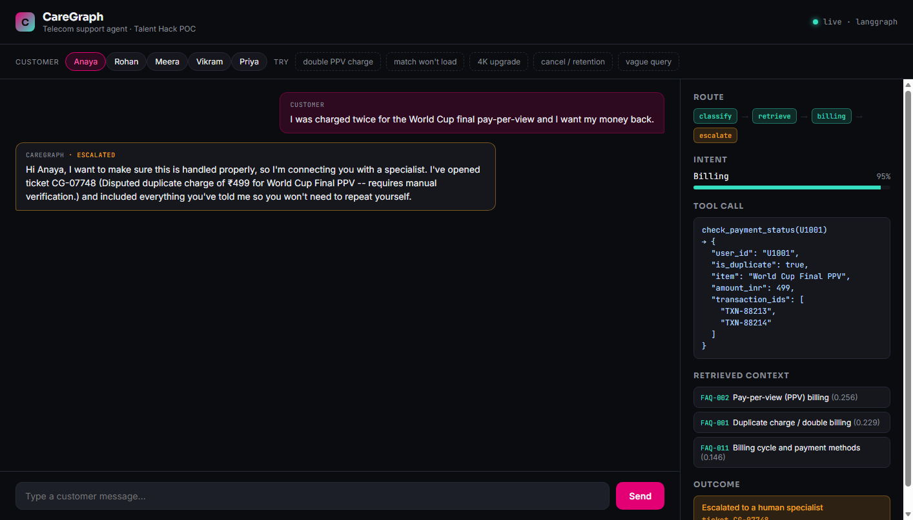

# CareGraph

A working support app: a FastAPI backend plus a browser chat UI, built around a single LangGraph agent. It replaces separate billing / network / streaming / plan support flows with one conversation. Answers are grounded in policy docs through RAG, backed by mock tools that stand in for real backend systems, and the agent knows when to hand off to a human instead of guessing.

**Author:** Chandresh — built for *The Talent Hack*, July 2026
**Status:** working end to end in mock mode (see [Evaluation](#evaluation)), ready to connect to a real LLM and real backend APIs.
**License:** MIT · **CI:** the classifier/retrieval eval runs automatically on every push (`.github/workflows/eval.yml`)

---

## The problem

Telecom operators running live sports streaming at scale (think: a World Cup, tens of millions of concurrent viewers, spikes of a thousand-plus purchases a minute) see a matching spike in support tickets — billing disputes, streaming failures, plan upgrades, people threatening to cancel. Today these usually get routed through separate flows depending on the issue type. CareGraph is one agent that classifies the request, pulls the right grounding context, calls the right backend tool, and either resolves it end to end or hands it to a human with full context — it never silently guesses on something like a disputed charge.

Two scenarios drove the design, because they need genuinely different handling:

1. **A payment retry causes a duplicate charge.** Someone buys a pay-per-view match, the request times out under load, they retry, and now they've been billed twice. This needs a human to verify it, not an instant auto-refund — it's exactly the kind of case an agent should recognize it can't safely close on its own.
2. **Regional network congestion degrades a stream during a big match.** "The match won't load" is the single most predictable ticket during a major live event, and it's one the agent *can* resolve on its own — explain what's happening, give a fix, apply a credit, done.

## What it does

1. Classifies the incoming message into `billing / network / streaming / plan / retention / unknown`, with a confidence score.
2. Retrieves the most relevant policy/FAQ snippets via RAG, on every request, so replies are always grounded in something real.
3. Routes to a specialist node, which calls the relevant mock backend tool(s).
4. Lets that specialist escalate on its own — a disputed charge or a major outage doesn't get auto-resolved even if the intent was classified correctly.
5. Escalates anything low-confidence or unresolved with a ticket and a full reason attached, so the customer doesn't have to repeat themselves to a human.

## The app

`api.py` is a FastAPI backend with three endpoints (`/api/chat`, `/api/users`, `/api/health`) wrapping the graph, serving a static chat UI at `/`. The UI has two panels:

- **Left — the conversation.** Pick a seeded customer (or type your own message).
- **Right — the agent's reasoning, live.** Which path the request took through the graph, the confidence score, the exact tool call and its result, which FAQ/policy snippets got pulled in, and the outcome (resolved, or escalated with a ticket ID).

That right-hand panel is the actual point of the UI — most chat demos only show the reply. Showing *why* the agent is confident enough to act (or not) is what makes it obviously agentic rather than just a scripted chatbot. Five scenario buttons reproduce `demo.py`'s five test cases in one click each.



## Architecture


| Node | Responsibility |
|---|---|
| `classify_intent` | LLM call → `(intent, confidence)` |
| `retrieve_context` | TF-IDF retrieval over `data/faq_corpus.json`, always runs so every path is grounded |
| `billing` / `network` / `streaming` / `plan` / `retention` | call the matching mock tool(s); each can set `escalate=True` on its own |
| `escalate` | raises a ticket, drafts a handoff message with the reason attached |
| `generate_response` | drafts the grounded final reply from tool output + retrieved context |

## Tech stack

| Area | Where it lives |
|---|---|
| Core Python | Entire project — typed, modular, unit-tested |
| LLM calls | `src/llm.py` — response generation grounded in tool output + retrieved context |
| Agent graph | `src/graph.py` — autonomous routing, tool calls, and a self-directed decision to escalate |
| LLM backend | `OpenAILLM` in `src/llm.py` (ChatOpenAI via LangChain) |
| RAG | `src/rag.py` — TF-IDF retrieval over `data/faq_corpus.json` |
| LangChain | `ChatPromptTemplate`, `BaseRetriever` adapter, `\|` chain composition in `llm.py` / `rag.py` |
| LangGraph | `src/graph.py` — `StateGraph`, conditional edges, compiled runnable |
| App layer | `api.py` (FastAPI) + `web/index.html` — turns the graph into something clickable |

## Design notes

- **Every module degrades gracefully.** `MockLLM` and `OpenAILLM` implement the same two-method interface; `get_llm_backend()` picks one based on whether `OPENAI_API_KEY` is set and `langchain_openai` is importable. Same pattern for the LangChain `BaseRetriever` wrapper in `rag.py`. This is what makes the whole thing testable offline — no need to burn API calls just to check the routing logic works.
- **Retrieval is TF-IDF, not embeddings, on purpose.** For a few dozen policy snippets, lexical retrieval works about as well as embeddings and needs no API calls, which is nice while iterating on prompts and routing. Swapping in FAISS/Chroma + real embeddings only touches `rag.py`.
- **Escalation is its own node, not an afterthought.** A specialist can get the intent right and still decide the case needs a human. Intent and resolution are separate decisions.
- **Nodes are plain functions with no LangGraph import.** `nodes.py` never imports `langgraph`, so every node is a one-line unit test (see `eval/run_eval.py`), and the same logic runs under a dependency-free fallback (`orchestrator.py`) if `langgraph` isn't installed.
- **Ticket IDs use `zlib.crc32`, not Python's `hash()`.** `hash()` on strings is randomized per process in Python 3 — fine for a dict lookup, useless if you want the same input to produce the same ticket ID across runs.
- **The UI shows its reasoning instead of hiding it.** Most chat UIs only show the reply. Here the routing path, confidence, tool call, and retrieval results stay visible for the last turn, because for an agent the interesting question isn't "what did it say" but "why did it decide that."

## Project structure

```
caregraph/
├── README.md
├── LICENSE
├── .gitignore
├── .github/workflows/eval.yml   # CI: runs eval/run_eval.py on every push
├── requirements.txt
├── .env.example
├── demo.py                # run 5 end-to-end scenarios (CLI)
├── api.py                 # FastAPI backend -- the real app entry point
├── docs/
│   └── screenshot.png     # UI screenshot used above
├── web/
│   └── index.html         # chat UI + live agent-reasoning trace panel
├── src/
│   ├── state.py            # CareGraphState TypedDict
│   ├── tools.py             # mock backend systems
│   ├── rag.py                # TF-IDF retriever + LangChain adapter
│   ├── llm.py                 # MockLLM / OpenAILLM, same interface
│   ├── nodes.py                 # node + routing functions (no langgraph import)
│   ├── graph.py                  # real LangGraph StateGraph (primary deliverable)
│   └── orchestrator.py            # zero-dependency fallback runner
├── data/
│   └── faq_corpus.json      # 12 policy/FAQ chunks
└── eval/
    ├── eval_set.json         # 12 labeled routing examples
    └── run_eval.py             # classifier + retrieval eval harness
```

## Setup & run

**The full app** (chat UI backed by the real agent):

```bash
pip install -r requirements.txt
cp .env.example .env            # optional -- add OPENAI_API_KEY for the real LLM
uvicorn api:app --reload
# open http://localhost:8000
```

Pick a seeded customer, click one of the five scenario buttons (or type your own message), and watch the right-hand panel fill in: routing path, classified intent and confidence, the exact tool call and its result, which FAQ/policy snippets got retrieved, and whether the case resolved or escalated (with a ticket ID if it did).

**CLI only**, no server, for a quick terminal walkthrough of the same logic:

```bash
python demo.py                 # runs the 5 scenarios end-to-end
python eval/run_eval.py         # classifier + retrieval accuracy report
```

Without `langgraph` installed, or with no `OPENAI_API_KEY` set, everything still runs end to end — both `api.py` and `demo.py` auto-detect and fall back to the mock LLM and the dependency-free orchestrator. The UI's status line shows which one is live (`langgraph` vs `fallback-orchestrator`).

## Example run

Actual output, captured from this repo, MockLLM backend (no API key needed to reproduce):

```
SCENARIO: Duplicate PPV charge (World Cup Final) -> should escalate
USER (U1001): I was charged twice for the World Cup final pay-per-view and I want my money back.
intent          : billing  (confidence=0.95)
escalated       : True
ticket_id       : CG-07748
CareGraph reply : Hi Anaya, I want to make sure this is handled properly, so I'm connecting
you with a specialist. I've opened ticket CG-07748 (Disputed duplicate charge of ₹499 for
World Cup Final PPV -- requires manual verification.) and included everything you've told me
so you won't need to repeat yourself.

SCENARIO: Match won't load during peak hours -> should self-resolve
USER (U1003): The India vs Brazil match keeps buffering and won't load, what's going on?
intent          : streaming  (confidence=0.94)
escalated       : False
CareGraph reply : Hi Meera, thanks for flagging that. Your stream is affected by stream
degraded during live event -- this is on our side, not your connection. It should clear up
in about 15 minutes. In the meantime, try switching quality to Auto or reconnecting to the
nearest server. We've applied a service credit to your account for the disruption, no action
needed from you.
```

Full output (all 5 scenarios: billing-escalate, streaming-resolve, plan-resolve, retention-resolve, unknown-escalate) is reproduced by running `python demo.py`.

## Push to GitHub

```bash
git init
git add .
git commit -m "CareGraph: LangGraph support agent"
git branch -M main
git remote add origin https://github.com/<your-username>/caregraph.git
git push -u origin main
```

`.gitignore` already excludes `.env`, virtual envs, and `__pycache__/`, so no secrets or local cruft end up in the repo. The GitHub Actions workflow in `.github/workflows/eval.yml` runs the eval harness on every push automatically.

## Evaluation

```
Intent classification -- backend: mock
Accuracy: 12/12 = 100%

Retrieval smoke test (top-1 topic match)
Retrieval top-1 accuracy: 5/5 = 100%
```

100% isn't impressive on a hand-built 12-example set — the point of `eval/run_eval.py` is that the harness is backend-agnostic. Point `OPENAI_API_KEY` at a real key and the same script evaluates `OpenAILLM` instead of `MockLLM`, no code changes needed. Ship the harness, not just the classifier, so you know when it stops working.

## Limitations & next steps

What's mocked vs. real, upfront:

- **Tools are seeded, in-memory mocks**, not real billing/network/CRM systems. Swapping them for real API calls doesn't touch `nodes.py`, only `tools.py`.
- **Retrieval is lexical (TF-IDF)**, which is fine at this corpus size. At production scale this would move to embeddings and a real vector store (FAISS/Chroma/Qdrant).
- **No conversation memory across turns** — each query is a fresh `CareGraphState`. Next step: thread a session id through and persist state.
- **No guardrails layer yet** — no PII redaction, no prompt-injection defense on retrieved content, no rate limiting. Would need this before it touches a real customer.
- **The confidence threshold (0.55) and keyword lists in `MockLLM` are hand-tuned**, not learned — expected, since it's standing in for a real LLM call, not a shipped classifier.

## Stage 2

This project is already the shape the build sprint asked for: a real support problem, working code, a clear line between what's mocked and what's real, and a demo that runs in under a minute. From here, the natural next steps are multi-turn memory or wiring up one real tool integration.
